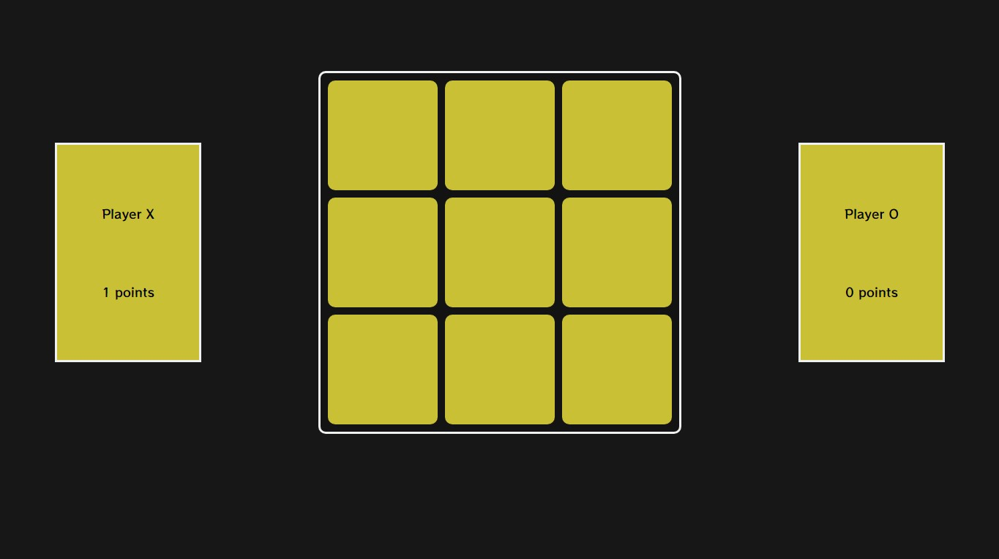
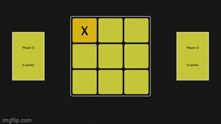
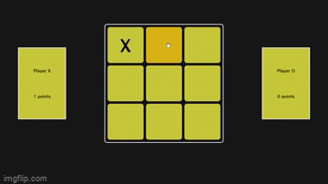

<h1 align="center">❌ Simple Tic Tac Toe game ⭕ </h1>

<h2 align = "center">

</h2> 

### Detects when have a winner and count points

### And when it's a draw

# 🛠️ Techs

💻 HTML

💻 CSS

💻 JavaScript

### 🌟 Just a simple project to test my skills knowledge in front-end
